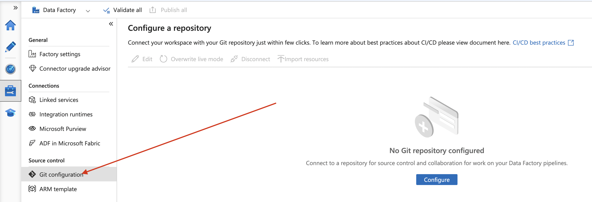

# CI/CD Documentation for Azure Data Factory with Azure DevOps

## Overview

This documentation describes the implementation of a Continuous Integration and Continuous Deployment (CI/CD) process for Azure Data Factory using Azure DevOps as both the repository and automation engine (deployment pipeline).

## Architecture Overview

- Git Repository: Azure DevOps Repos  
- Environments: `Dev` and `QA` 
- Pipelines:   
  - CI/CD: Automatic deployment to QA environment  
- Deployed Resources:  
  - Main Artifacts
  - Secondary Artifacts

## Git Configuration

The Git integration with Azure DevOps is straightforward and easy to set up. It’s important to understand the roles of the **collaboration** and **publish** branches. The **collaboration** branch is where all artifacts are organized in a folder-based structure during **development**. In contrast, the **publish** branch is used by the deployment pipeline and contains all necessary artifacts derived from the **collaboration** branch but transformed into a JSON template format that simplifies the deployment process. Therefore, it’s considered a good practice to keep these two branches separate.

#### Step 1: Open Data Factory and Click **Manage**


#### Step 2: Click Git Configuration



#### Step 3: Click Configure


#### Step 4: Configure both repository and Microsoft Entra ID. When done, click **continue**


#### Step 5: Configure your repository with its corresponding data, have in mind what's been explained about **collaboration** and **publish** branch


#### Final step: click on **Apply** and that's it!

## Repository Structure

```plaintext
-adf_publish
/ (root)
├── datafactory/
│   ├── notebooks/
│   ├── pipelines/
│   ├── datasets/
│   ├── linkedServices/
│   └── sqlScripts/
├── azure-pipelines.yml
```

## CI/CD Pipeline in Azure DevOps

- Location: `/azure-pipelines.yml`  
- Goals:
- Deploy artifacts into QA workspace

```yml
name: Release-$(rev:r)

trigger:
  branches:
    include:
    - adf_publish

resources:
  repositories:
  - repository: jkDataFactory
    type: git
    name: jkDataFactory
    ref: adf_publish

variables:
  - group: DF_variables
  
stages:
- stage: Release
  displayName: Release stage
  jobs:
    - job: Release
      displayName: Release job
      pool:
        vmImage: 'Windows-2019'
      steps:
        - checkout: jkDataFactory

        - task: AzurePowerShell@5
          displayName: Stop Triggers
          inputs:
            azureSubscription: '$(azureSubscription)'
            ScriptType: 'InlineScript'
            Inline: 
              $triggersADF = Get-AzDataFactoryV2Trigger -DataFactoryName   
              "$(DeployDataFactoryName)" -ResourceGroupName "$(DeploymentResourceGroupName)";
              $triggersADF | ForEach-Object { Stop-AzDataFactoryV2Trigger –
              ResourceGroupName "$(DeploymentResourceGroupName)" -DataFactoryName   
              "$(DeployDataFactoryName)" -Name $_.name -Force }
            azurePowerShellVersion: 'LatestVersion'

        - task: AzureResourceManagerTemplateDeployment@3
          inputs:
            deploymentScope: 'Resource Group'
            azureResourceManagerConnection: '$(ServiceConnectionName)'
            subscriptionId: '$(subscriptionID)'
            action: 'Create Or Update Resource Group'
            resourceGroupName: '$(resourceGroupName)'
            location: 'Australia East'
            templateLocation: 'Linked artifact'
            csmFile: '$(System.DefaultWorkingDirectory)/$(SourceDataFactoryName)/ARMTemplateForFactory.json'
            csmParametersFile: '$(System.DefaultWorkingDirectory)/$(SourceDataFactoryName)/ARMTemplateParametersForFactory.json'
            overrideParameters: '-factoryName $(DeployDataFactoryName)'
            deploymentMode: 'Incremental'
          
        - task: AzurePowerShell@5
          displayName: Restart Triggers
          inputs:
            azureSubscription: '$(azureSubscription)'
            ScriptType: 'InlineScript'
            Inline: 
              $triggersADF = Get-AzDataFactoryV2Trigger -DataFactoryName   "$(DeployDataFactoryName)" -ResourceGroupName "$(DeploymentResourceGroupName)";
              $triggersADF | ForEach-Object { Start-AzDataFactoryV2Trigger -ResourceGroupName "$(DeploymentResourceGroupName)" -DataFactoryName "$(DeployDataFactoryName)" -Name $_.name -Force }
            azurePowerShellVersion: 'LatestVersion'

```

## Key notes

- Pipeline has 3 tasks, two of them (AzurePowerShell@5) are in other words, a traffic light functionality to avoid pipeline to run too many times when not desired. But both tasks won't affect pipeline's main goal. for more information visit: https://techcommunity.microsoft.com/blog/azuredatablog/azure-data-factory-ci-cd-using-yaml-template/3107341

- Main task: AzureResourceManagerTemplateDeployment@3. This is task will deploy all corresponding artifacts into the QA workspace.

- DO NOT CHANGE: 

## Library Variables

Check the following part of the code above:

```yml
variables:
  - group: DF_variables
```
 Variable group name is `DF_variables` you should create a **Variable Group** under Library Section in Azure Devops with that name. Variables:
 - azureSubscription = it's value must be your **Suscription Name**
 - ServiceConnectionName = it's value must be your **Service Connection Name** linked to the corresponding **QA Data Factory workspace**
 - subscriptionID = it's value must be your **Suscription ID**
 - resourceGroupName = it's value must be your **Resource Group Name** which is where the **QA Data Factory workspace** is located at
 - DeployDataFactoryName = it's value must be your **QA Data Factory Workspace Name** which is the one you where you want to deploy artifacts

## overrideParameters Feature

In some scenarios you would like to override some parameters as **Linked Service's connection strings** so this feature allows you to change the values you specify for those artifacts you'd like to change between different workspaces.

### How to do it?
The logic behind this is: Linked Services have unique values and they are most likely to be different between workspaces. So there is an **ARMTemplateParametersForFactory.json** file that will contain all artifacts definition and it's main value, you are suppose to copy the corresponding name of the artifact that might differ between environments and copy it's value from the Azure Portal GUI.

- **IMPORTANT:** This should be done BEFORE publishing any changes to the ADO repo.

#### Step 1:

Head to `datafactoryname/ARMTemplateParametersForFactory.json` and copy the name of the artifact you desire


#### Step 2:

Go to the Pipeline and add the corresponding artifact with its corresponding value as shown in the picture


## Connections

- `Service Connection`: Service connection in Azure DevOps with RBAC permissions

## Resources

- [Official Data Factory CI/CD Documentation](https://techcommunity.microsoft.com/blog/azuredatablog/azure-data-factory-ci-cd-using-yaml-template/3107341)  

## Notes

- Pipeline won't work the first time: when runnning the pipeline for the first time it will ask for an authorization it only takes a click into the UI
