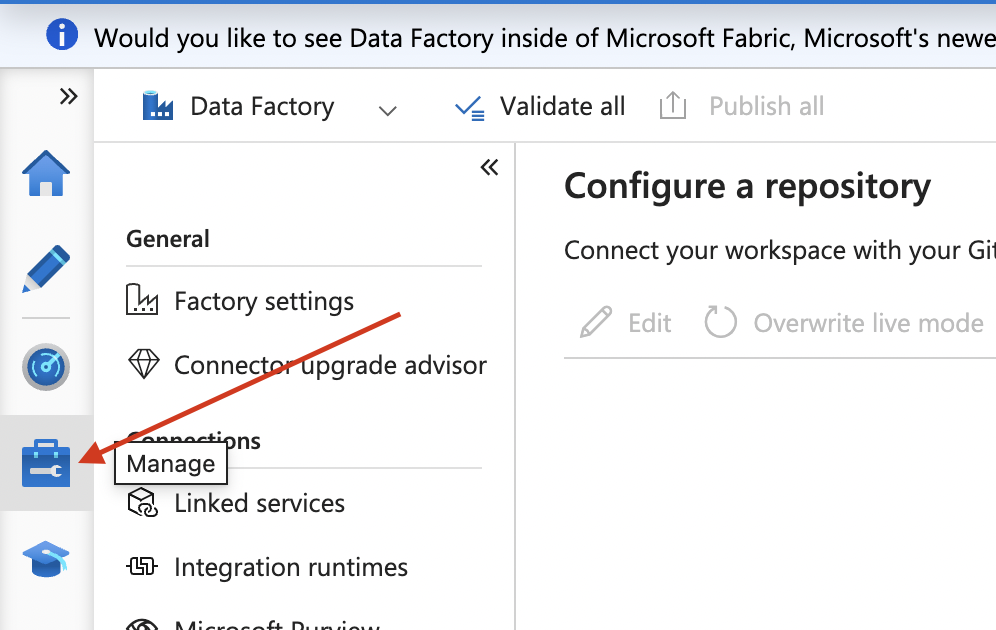
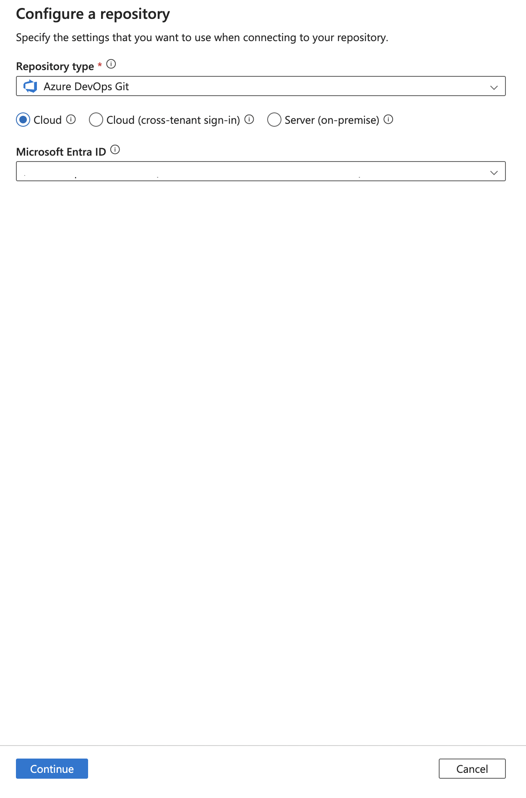

# CI/CD Documentation for Azure Data Factory with Azure DevOps

## Overview

This documentation describes the implementation of a Continuous Integration and Continuous Deployment (CI/CD) process for Azure Data Factory using Azure DevOps as both the repository and automation engine (deployment pipeline).

## Architecture Overview

- Git Repository: Azure DevOps Repos  
- Environments: `Dev` and `QA` 
- Pipelines:   
  - CI/CD: Automatic deployment to QA environment  
- Deployed Resources:  
  - Main Artifacts
  - Secondary Artifacts

## Git Configuration

The Git integration with Azure DevOps is straightforward and easy to set up. It’s important to understand the roles of the **collaboration** and **publish** branches. The **collaboration** branch is where all artifacts are organized in a folder-based structure during **development**. In contrast, the **publish** branch is used by the deployment pipeline and contains all necessary artifacts derived from the **collaboration** branch but transformed into a JSON template format that simplifies the deployment process. Therefore, it’s considered a good practice to keep these two branches separate.

#### Step 1: Open Azure Synapse and Click **Manage**



#### Step 2: Click Git Configuration


#### Step 3: Click Configure


#### Step 4: Configure both repository and Microsoft Entra ID. When done, click **continue**



#### Step 5: Configure your repository with its corresponding data, have in mind what's been explained about **collaboration** and **publish** branch


#### Final step: click on **Apply** and that's it!

## Repository Structure

```plaintext
-workspace_publish
/ (root)
├── workspace_name/
│   ├── TemplateForWorkspace.json
│   └── TemplateParametersForWorkspace.json
├── readme.md
```
## Pipeline creation

Create a .yml file for your new pipeline. Make sure that it is stored in the workspace_publish branch for it to trigger on pushes to this branch. The yaml content must be the following, it uses the default synapse deploy task to copy artifacts from the publish branch to the target resourse group. 

```yml
pool:
  vmImage: 'windows-latest'

stages:
- stage: Deploy
  displayName: 'Deploy Synapse Workspace'
  jobs:
  - deployment: DeployWorkspace
    environment: 'QA'
    strategy:
      runOnce:
        deploy:
          steps:
          - checkout: self
          - task: Synapse workspace deployment@2
            inputs:
                operation: 'deploy'
                TemplateFile: $(armTemplate)
                ParametersFile: $(templateParametersFile)
                azureSubscription: $(azureSubscription)
                ResourceGroupName: $(resourseGroup)
                TargetWorkspaceName: $(targetWorkspace)
                DeleteArtifactsNotInTemplate: false
                DeployManagedPrivateEndpoints: false
                OverrideArmParameters: '-workspaceName jk-napsty-synapse-qa'
                FailOnMissingOverrides: false
                Environment: 'prod'
                npmpackage: 'prod'
```

*Note: Remember that you can use the `settings` button to configure this task from the ui and fill data using dropdown menus*


## overrideParameters Feature

In some scenarios you would like to override some parameters as **Linked Service's connection strings** so this feature allows you to change the values you specify for those artifacts you'd like to change between different workspaces.

### How to do it?
The logic behind this is: Linked Services have unique values and they are most likely to be different between workspaces. So there is an `ARMTemplateParametersForWorkspace.json` file that will contain all artifacts definition and it's main value, you are suppose to copy the corresponding name of the artifact that might differ between environments and copy it's value from the Azure Portal GUI.

- **IMPORTANT:** This should be done BEFORE publishing any changes to the ADO repo.

#### Step 1:

Head to `datafactoryname/ARMTemplateParametersForWorkspace.json` and copy the name of the artifact you desire


#### Step 2:

Go to the Pipeline and add the corresponding artifact on the `OverrideArmParameters` field. You must follow the syntax `-parameterToOverride value1 -anotherParameter value2`


## Setting up permissions
This pipeline needs to be given the appropiate permisions in order to be able to deploy resources in the target resoure group. Therefore, a role must be created having the following permissions.

```
Microsoft.Synapse/workspaces/integrationruntimes/write
Microsoft.Synapse/workspaces/operationResults/read
Microsoft.Synapse/workspaces/read
```

In your target resource group, open the Access Control tab from the Azure portal UI and add a custom role.


Give it a custom name and select the permissions listed above. 


Just assign it to the service principal corresponding to your devops project.


Lastly, in your target synapse workspace you must give your servie principal the `Synapse artifact publisher` role.


## Resources

- [Official Synapse CI/CD Documentation](https://learn.microsoft.com/en-gb/azure/synapse-analytics/cicd/continuous-integration-delivery)  
- [Official Synapse CI/CD Pipeline Blog post](https://techcommunity.microsoft.com/blog/dataarchitectureblog/ci-cd-in-azure-synapse-analytics-part-4---the-release-pipeline/2034434)  

## Notes

- Pipeline won't work the first time: when runnning the pipeline for the first time it will ask for an authorization it only takes a click into the UI

# Legacy version

## CI/CD Release Pipeline in Azure DevOps

### Enabling Release Pipelines

Legacy "Release pipelines" in Azure DevOps may be disabled by default at organization level, therefore some aditional steps may be required for them to be enabled in the UI.

#### Step 1: In your organization's main page (where proyects are listed), click on **Organization settings**


#### Step 2: Click **Settings** under the **Pipelines** section


#### Step 3: Turn off the **Disable creation of classic release pipeline** checkbox


Now the release pipelines should be accessible from the project UI


*Note: Organization level configurations should cascade to project configurations, however in some scenarios it may be necessary to repeat these step at the project level for them to be applicable to the specific project* 

### Creating the pipeline

Head to the newly added "Releases" section and click on **Create pipeline**.

The interface for release pipelines has 2 sections, **Artifacts** and **Stages**. In the Artifacts section we must specify where our artifacts will be pulled from, in this case that is our Azure DevOps repository. To configure this, add a new artifact and select the repository connected to the dev Synapse environment. Make sure to select the *workspace_publish* branch as the default branch, since this where our ARM Templates will be stored. 


Stages are the set of consecutive steps that our pipeline will follow. Each stage contains tasks, who contain jobs. For this simple pipeline we will be using a single stage containing a task and a single job. For more information on this structure refer to [this documentation](https://learn.microsoft.com/en-us/azure/devops/pipelines/yaml-schema/?view=azure-pipelines).


The job we will be using is [Deploy Azure Synapse Workspace](https://marketplace.visualstudio.com/items?itemName=AzureSynapseWorkspace.synapsecicd-deploy), so make sure to add the extension from the marketplace before proceeding. 

Now, create a step, a single task and add the Deploy Azure Synapse Workspace job.


Fill the **Display name** parameter, set **Operation type** to **Deploy** and provide the paths to the ARM template files in the repository as follows. Remember to replace your dev workspace name. You can also click the three dots next to the entry fields to manually select both the template and template parameters file. 

Select your service connection and your **target resource group** (where you want the artifacts to be deployed), in this case it will be our qa resource group. The **Synapse workspace name** *must* match with the workspace created in the target resource group.


## Pipeline Variables

From the UI, you can setup as many environment variables as you may need using the **variables** tab. These will be scoped to the current pipeline. 


They will be needed to override sensible data inside the tasks. These variables are accessible through the $(variable_name) syntax as usual.


